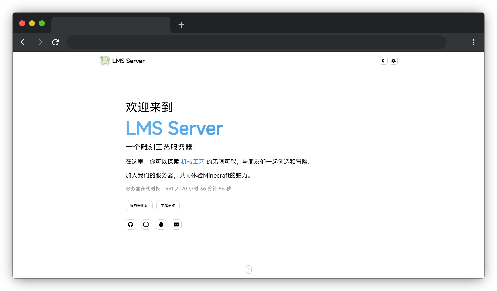

## 功能

- 显示服务器基本信息
- 显示服务器在线时长
- 提供服务器地址信息
- 提供打字机特效展示服务器描述
- 支持黑暗模式和白天模式切换
- 管理员登录后可修改服务器配置
- SEO优化和favicon配置

## 预览



## 启动项目

1. 启动后端服务器

    后端项目代码在 [LMS-Work/Official-Website-Backend](https://github.com/LMS-Work/Official-Website-Backend) 仓库中。

    克隆后端项目仓库：

    ```bash
    git clone https://github.com/LMS-Work/Official-Website-Backend.git
    cd Official-Website-Backend
    ```

    安装后端项目依赖：

    ```bash
    npm install
    ```

    启动后端服务器：

    ```bash
    node index.js
    ```

2. 启动前端服务器  
   
    安装前端项目依赖：

    ```bash
    npm install
    ```

    确保你在项目根目录下，并运行：

    ```bash
    npm start
    ```

## 使用指南

### 首页

- 浏览服务器的基本信息
- 查看服务器在线时长
- 点击“服务器地址”按钮查看详细的服务器地址信息
- 点击“了解更多”获取更多信息
- 点击右上角的太阳/月亮图标切换白天/黑暗模式

### 管理界面

- 点击右上角的齿轮图标进入管理界面
- 输入管理密码进行登录
- 登录后可以修改服务器的配置
- 修改后点击“保存设置”按钮保存更改

## 技术栈

- React
- TypeScript
- Express
- WebSocket
- Axios
- React Router
- web-vitals
- FontAwesome

## 许可证

此项目使用 [MIT 许可证](LICENSE)。
